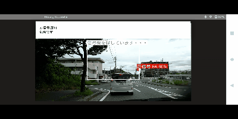
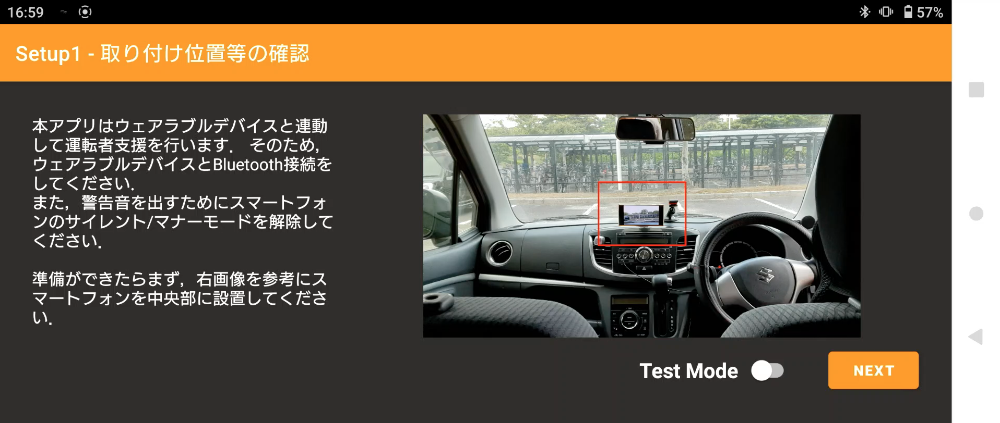
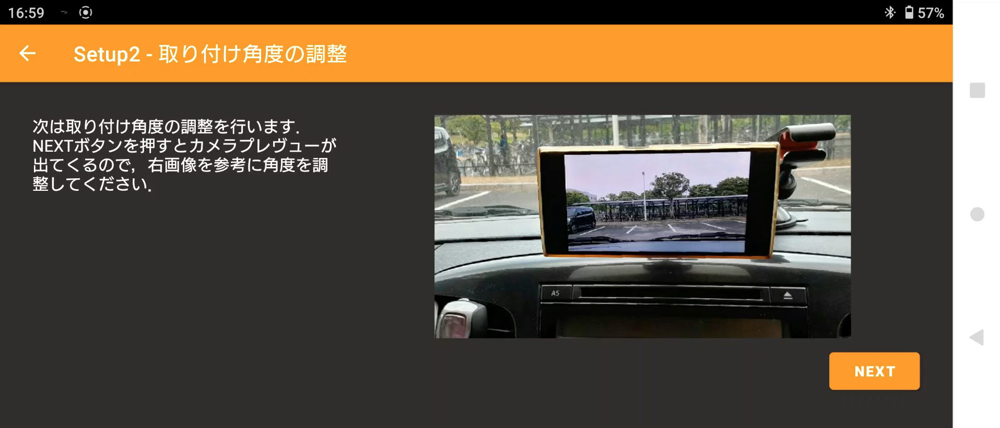
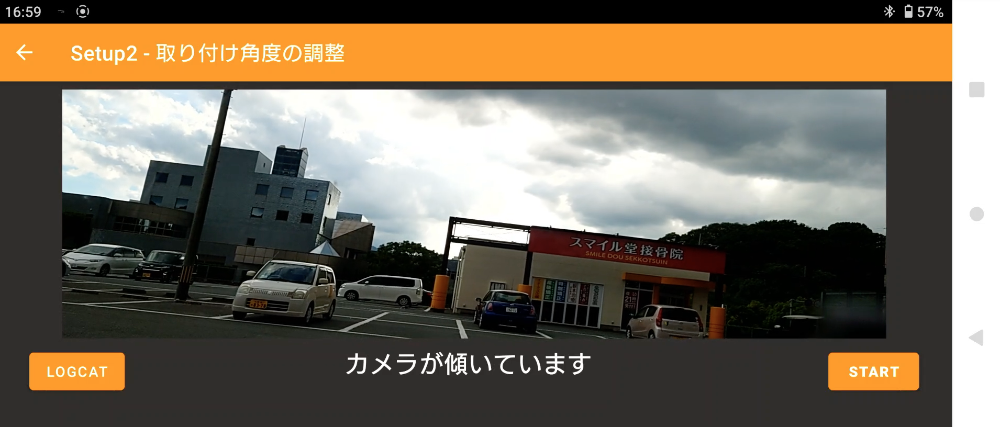

# Smart ASV App

## Overview
#### This application is an advanced safety application that uses a smart device to detect red lights and alert the user.
## Background
#### We think that driver assistance systems are expensive to implement, and therefore we need inexpensive applications that can be retrofitted to automobiles. Since many people already own smartphones and they are equipped with cameras and various sensors, we have developed an application using smartphones.
## Details
#### This application uses a smartphone retrofitted to an automobile and a wearable device attached to the arm. First, when the application is launched, the user sets up the installation angle and other settings. The app then uses Google Maps to detect intersections, GPS to determine vehicle speed, and AI to detect traffic signals and provide appropriate warnings to the user.
### Setup
#### The setup screen first prompts the user to deactivate the manner mode for the warning sound. Next, it checks if the smartphone is placed at an appropriate angle using the 3-axis acceleration sensor. Only when the setup is complete can the user move to the next step.

### Main
#### The system performs inference processing for traffic signals only near intersections and when vehicles are above a certain speed. In addition, a region of interest (ROI) is set up to detect traffic signals from a distance. This enables detection from a distance of 80 meters away from the intersection. When a red light is detected, the system alerts the user using a smartphone and a wearable device.

